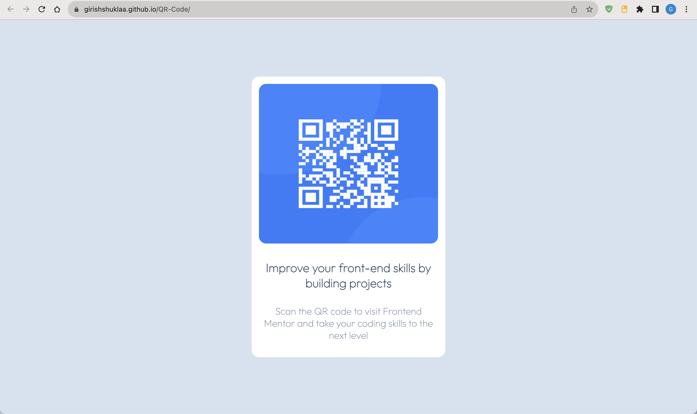

# Frontend Mentor - QR code component solution

This is a solution to the [QR code component challenge on Frontend Mentor](https://www.frontendmentor.io/challenges/qr-code-component-iux_sIO_H). Frontend Mentor challenges help you improve your coding skills by building realistic projects. 

## Table of contents

- [Overview](#overview)
  - [Screenshot](#screenshot)
  - [Links](#links)
- [My process](#my-process)
  - [Built with](#built-with)
  - [What I learned](#what-i-learned)
- [Author](#author)
- [Acknowledgments](#acknowledgments)


## Overview
I successfully completed the challenge using fundamental knowledge of HTML and CSS, specifically leveraging the Flexbox layout model. This project showcases my ability to create visually appealing designs while effectively utilizing modern web development techniques.

### Screenshot



This above picture show the Screenshot of my page.

### Links

- Solution URL: https://github.com/GIRISHSHUKLAA/QR-Code.git
- Live Site URL: https://girishshuklaa.github.io/QR-Code/


### Built with

- Semantic HTML5 markup
- CSS custom properties
- Flexbox
- [Styled Components](https://styled-components.com/) - For styles

### What I learned

"""
Using my fundamental understanding of HTML and CSS, I have successfully accomplished this challenge. I have refreshed my familiarity with flexbox in order to complete this challenge.


```html
<!DOCTYPE html>
<html lang="en">

<head>
  <meta charset="UTF-8">
  <meta name="viewport" content="width=device-width, initial-scale=1.0">
  <!-- displays site properly based on user's device -->

  <link rel="icon" type="image/png" sizes="32x32" href="./images/favicon-32x32.png">
  <link rel="preconnect" href="https://fonts.googleapis.com">
  <link rel="preconnect" href="https://fonts.gstatic.com" crossorigin>
  <link href="https://fonts.googleapis.com/css2?family=Hind:wght@300&family=Outfit:wght@100&display=swap"
    rel="stylesheet">
  <link rel="stylesheet" href="style.css">

  <title>Frontend Mentor | QR code component</title>

</head>

<body>

  <div class="container">
    <div class="image">
      
      <p> Improve your front-end skills by building projects </p>
      <p>Scan the QR code to visit Frontend Mentor and take your coding skills to the next level</p>
    </div>
  </div>


  <div class="attribution">
    Challenge by <a href="https://www.frontendmentor.io?ref=challenge" target="_blank">Frontend Mentor</a>.
    Coded by <a href="https://github.com/GIRISHSHUKLAA">Girish</a>.
  </div>
</body>

</html>
```
```css
* {
  margin: 0;
  padding: 0;
  box-sizing: border-box;
  font-family: "Hind", sans-serif;
  font-family: "Outfit", sans-serif;
}
.container {
  width: 100vw;
  height: 100vh;
  background-color: hsl(212, 45%, 89%);
  display: flex;
  justify-content: center;
  align-items: center;
}

.image {
  width: 400px;
  height: 580px;
  background: hsl(0, 0%, 100%);
  border-radius: 15px;
  padding: 15px;
}

.image img {
  width: 100%;
  height: 60%;
  border-radius: 15px;
}

.image p {
  font-size: 25px;
  font-weight: 700;
  text-align: center;
  color: hsl(218, 44%, 22%);
  padding-top: 30px;
}

.image p:nth-child(3) {
  font-size: 20px;
  font-weight: 400;
  text-align: center;
  color: hsl(220, 15%, 55%);
}

/* Screen size 375px */
@media only screen and (max-width: 375px) {
  .image {
    width: 310px;
    height: 480px;
    background: hsl(0, 0%, 100%);
    border-radius: 15px;
    padding: 10px;
  }
  .image p {
    font-size: 15px;
    font-weight: 700;
    text-align: center;
    color: hsl(218, 44%, 22%);
    padding-top: 30px;
  }
}


### Future Enhancements

While this project successfully demonstrates my grasp of HTML and CSS, there are several potential improvements on the horizon:

- CSS Grid Integration: Consider integrating CSS Grid layout techniques to expand your repertoire and create more complex and intricate designs.
- JavaScript Interactivity: Incorporate JavaScript to add interactivity and dynamic features, enhancing user engagement and creating a more polished user experience.
- Browser Compatibility: Extend compatibility testing to a wider range of browsers and devices to ensure a seamless experience for all users.


### Useful resources

- [Frontend Mentor](https://www.frontendmentor.io/home)) - I get this challenge from Frontend Mentor. It's a beautiful community to join.


## Author

- Website - [Girish](https://github.com/GIRISHSHUKLAA))


## Acknowledgments

I appreciate [Frontend Mentor]'s provision of this challenge, as it presents an opportunity for me to enhance my skills.

